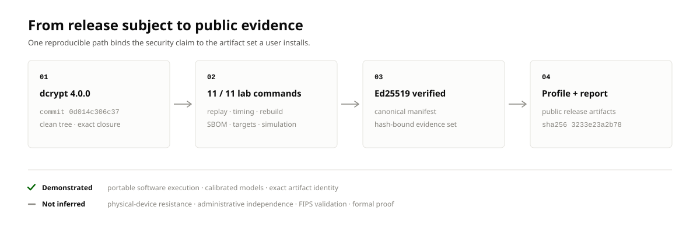

# dcrypt assurance

## Security claims with addresses.

dcrypt treats assurance as a product surface. Every release carries a profile
that answers four practical questions:

1. What exact software was evaluated?
2. Which attacks, regressions, and correctness checks were exercised?
3. What did those checks observe?
4. Can another person reproduce the result?

The profile is built automatically from the same laboratory report that gates
the release. Its numbers are not copied into a dashboard by hand, and they are
not collapsed into a proprietary score. A user can move from a headline result
to its machine field, evidence class, source model, and reproduction command.

[Download the v4 visual report](https://github.com/ioi-foundation/dcrypt/releases/download/v4.0.0/assurance-report.html) ·
[Inspect the v4 evidence ledger](V4-SUMMARY.md) ·
[Download the public profile](https://github.com/ioi-foundation/dcrypt/releases/download/v4.0.0/assurance-profile.json) ·
[Reproduce it](REPRODUCE.md)

<a href="V4-SUMMARY.md">
  <picture>
    <source media="(prefers-color-scheme: dark)" srcset="assets/v4-evidence-flow-dark.svg">
    
  </picture>
</a>

## The released evidence surface

Most security documentation asks the reader to inherit a conclusion. dcrypt
publishes a navigable evidence surface instead:

| Layer | What a user receives | Why it matters |
| :--- | :--- | :--- |
| Release identity | Exact version, commit, tree, clean-worktree record, and profile digest | Prevents results from floating free of the code they describe |
| Security signals | Separate simulation, product-execution, correctness, build, and supply-chain results | Preserves the meaning and limitations of each measurement |
| Inspectable artifacts | Machine JSON, self-contained HTML, signed manifest, and referenced raw reports | Lets policy and people inspect the same result without scraping prose |
| Reproduction path | Fixed laboratory command, disclosed controls, seeds, thresholds, and target matrix | Turns verification into an executable workflow instead of a marketing promise |

The [`v4.0.0` summary](V4-SUMMARY.md) is generated from the exact profile
attached to the public release. Its graphics and tables are projections of that
profile, so changing a displayed number without changing the source evidence
causes the documentation check to fail.

## Two kinds of evidence, one visible boundary

The dcrypt Open Security Lab combines measured product executions with
calibrated simulation controls.

**Measured product evidence** executes the release candidate: historical
vulnerability regressions, standards-vector replay, timing analysis, supported
target builds, compiler-shape inspection, SBOM generation, package rebuilds,
and manifest verification.

**Calibrated simulation** deliberately introduces known signals. A seeded
Hamming-weight model tests whether the leakage-analysis pipeline detects a
positive control without flagging its negative control. An exhaustive
single-bit mutation campaign tests whether the declared artifact-integrity
model detects every injected fault.

Simulation does not stand in for measurements on a particular physical device.
It establishes something independently valuable: the analysis machinery can
detect the controlled conditions it claims to detect. The report always labels
the evidence class so these conclusions cannot be silently conflated.

## The Assurance Profile

Each complete laboratory run emits:

- `assurance-profile.json`, a stable machine-readable projection;
- `assurance-report.html`, a self-contained interactive report;
- `lab-report.json`, the command, environment, subject, and result record;
- `evidence-manifest.json` and its ephemeral Ed25519 signature;
- replay, package, SBOM, and timing artifacts referenced by digest.

The report begins with the security result, then exposes the model, scope, raw
case-level timing decisions, subject identifiers, and reproduction command.
The JSON profile is suitable for release policy, procurement archives, or a
deployment gate without scraping the visual presentation.
The public structure is documented by
[`assurance-profile.schema.json`](assurance-profile.schema.json).

## Assurance that moves with the software

The profile belongs to one exact subject. Source, dependency, compiler, target,
or release-artifact changes require a new laboratory run and a new profile.
The release workflow automatically reruns the laboratory after version
preparation so the attached profile describes the final versioned commit.

Old evidence remains a historical record for its original subject; it is never
silently transferred to new code. The public states use operational language:

- **Evidence current for this subject** — all declared gates passed for the
  recorded subject.
- **Evidence refresh required** — the intended subject no longer matches the
  recorded profile or a required evidence input changed.
- **Release superseded** — a newer supported release replaces this subject.
- **Release withdrawn** — the project no longer supports deployment of this
  subject.

## Start with the evidence

- [v4.0.0 evidence ledger and graphics](V4-SUMMARY.md)
- [Public v4.0.0 release](https://github.com/ioi-foundation/dcrypt/releases/tag/v4.0.0)
- [Open Security Lab](OPEN-SECURITY-LAB.md)
- [Metric definitions](METRICS.md)
- [Reproduction guide](REPRODUCE.md)
- [Portable v4 release profile](../../assurance/release-profile/README.md)
- [Daybreak adversarial review](../../assurance/release-lab/DAYBREAK-THREAT-REVIEW.md)
