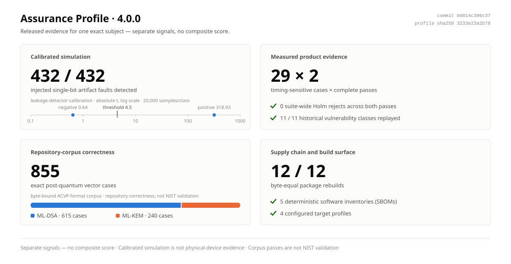
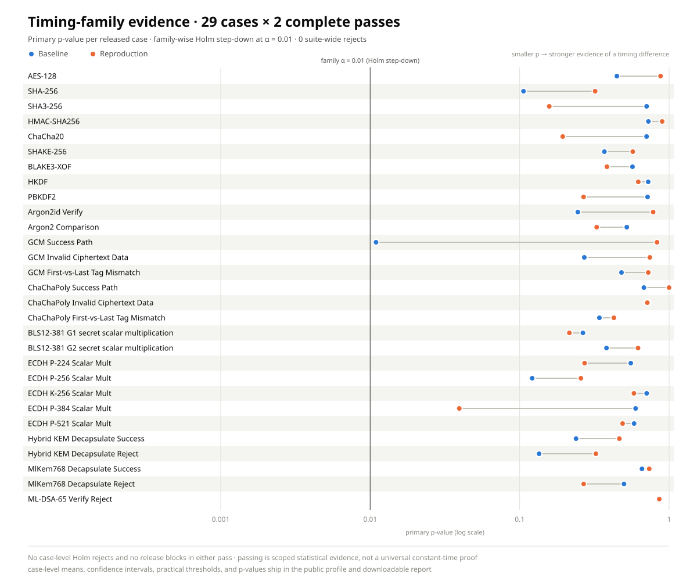

<!-- Generated by tools/generate-assurance-docs.py. Do not edit by hand. -->

# dcrypt 4.0.0 Assurance Profile at a glance

> Security claims with an address: one exact release, one inspectable result,
> and a public path from headline metric to evidence.

[Download the visual report](https://github.com/ioi-foundation/dcrypt/releases/download/v4.0.0/assurance-report.html) ·
[Download the public profile](https://github.com/ioi-foundation/dcrypt/releases/download/v4.0.0/assurance-profile.json) ·
[View the GitHub release](https://github.com/ioi-foundation/dcrypt/releases/tag/v4.0.0) ·
[Reproduce the laboratory](REPRODUCE.md)

<a href="https://github.com/ioi-foundation/dcrypt/releases/download/v4.0.0/assurance-report.html">
  <picture>
    <source media="(prefers-color-scheme: dark)" srcset="assets/v4-assurance-overview-dark.svg">
    
  </picture>
</a>

| Security signal | Released result | Evidence class | Inspect |
| :--- | :--- | :--- | :--- |
| Injected artifact faults | **432 / 432 detected** | calibrated simulation | `metrics.artifact_faults` · [fault model](OPEN-SECURITY-LAB.md#fault-simulation) |
| Leakage-detector calibration | **20,000 samples/class**; positive absolute t 318.93; negative absolute t 0.64 | calibrated simulation | `metrics.leakage_calibration` · [calibration model](OPEN-SECURITY-LAB.md#leakage-calibration) |
| Timing-sensitive paths | **29 cases × 2 complete passes**; 0 suite-wide Holm rejects | measured product evidence | `metrics.timing` · [statistical policy](METRICS.md#timing-visualization) |
| Historical vulnerability classes | **11 / 11 replayed** | measured product evidence | `metrics.historical_replay` · [advisory index](../security/README.md) |
| Post-quantum vector cases | **855 exact cases** (615 ML-DSA + 240 ML-KEM) | repository corpus correctness | `metrics.standards` · [terminology](METRICS.md#standards-vector-terminology) |
| Publishable packages | **12 / 12 byte-equal rebuilds** | measured product evidence | `metrics.packages` · [release-lab evidence](../../assurance/release-lab/README.md) |
| Software inventories | **5 deterministic SBOMs** | measured product evidence | `metrics.sboms` · [release-lab evidence](../../assurance/release-lab/README.md) |
| Configured targets | **4 target profiles** | build and compiler shape evidence | `metrics.platforms` · [boundary policy](../../implementation-boundary.toml) |

## Timing-family coverage

<a href="https://github.com/ioi-foundation/dcrypt/releases/download/v4.0.0/assurance-report.html">
  <picture>
    <source media="(prefers-color-scheme: dark)" srcset="assets/v4-timing-family-dark.svg">
    
  </picture>
</a>

Each row is one released timing-sensitive case. The paired dots mark the
primary p-value observed in each complete family pass on a logarithmic scale
against the family-wise Holm policy; neither pass produced a case-level Holm
reject or a release block. The downloadable report preserves case-level means,
thresholds, confidence intervals, and primary p-values.

## Evidence identity

| Field | Value |
| :--- | :--- |
| Release | [`v4.0.0`](https://github.com/ioi-foundation/dcrypt/releases/tag/v4.0.0) |
| Subject commit | [`0d014c306c371b4d42d85001affb036f9fe4d3c3`](https://github.com/ioi-foundation/dcrypt/commit/0d014c306c371b4d42d85001affb036f9fe4d3c3) |
| Public profile SHA-256 | `3233e23a2b78b6f4886da798b3dade0ced4c3b870f0691243bfbe587131445ab` |
| Tracked profile snapshot | [`releases/v4.0.0/assurance-profile.json`](releases/v4.0.0/assurance-profile.json) |
| Source view | [`v4.0.0`](https://github.com/ioi-foundation/dcrypt/tree/v4.0.0) |

The bars and counts above are separate signals, not a composite score. The
profile demonstrates the recorded software executions and calibrated simulation
models. It does not convert software simulation into a physical-device result,
an independent audit, FIPS validation, or formal verification.
